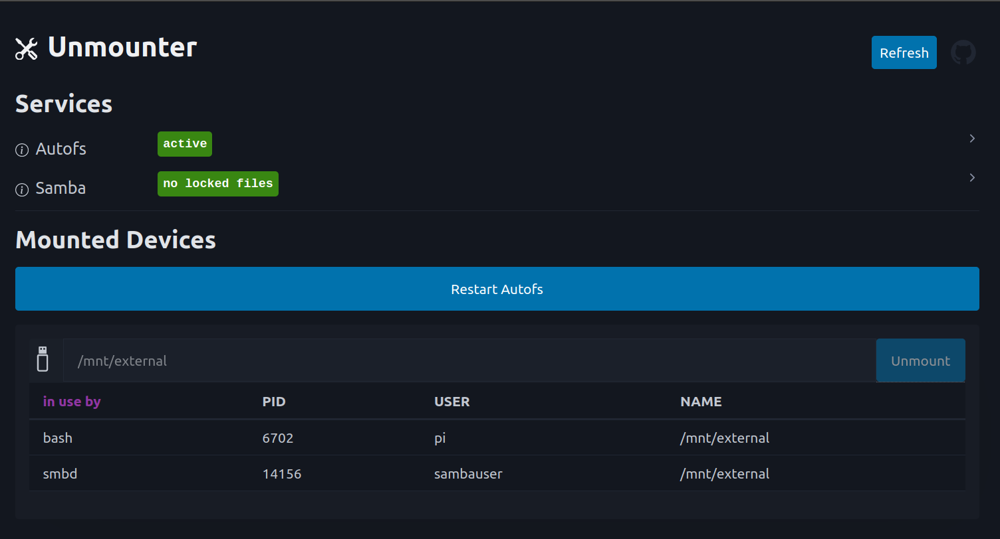
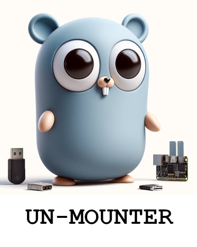

# Unmounter

Its a little web app that allows you to unmount your usb exfat drive. Its nice for using it with a raspberry pi that runs home assistant as a server or a file share via samba for example.



## Installation
### 1. autofs for automatically mounting your usb exfat disk on reboot or restart of autofs
```
sudo apt update && sudo apt install autofs lsof
# then add this line to /etc/auto.master
/- /etc/auto.external --timeout=30
# then add this line to /etc/auto.external
/mnt/external -fstype=exfat,rw,umask=000 :/dev/disk/by-uuid/{{YOUR DEVICE ID}}
# enable the service and start the service
sudo systemctl enable autofs
sudo systemctl start autofs
```

### 2. add user for running the unmounter service
```
sudo useradd -r -s /bin/false unmounter
```

### 3. add rights to the new user
```
unmounter ALL=(root) NOPASSWD: /usr/bin/kill, /bin/umount -- /mnt/external, /bin/systemctl restart autofs, /usr/bin/smbstatus --locked, /usr/bin/lsof -- /mnt/external
```

### 4. adjust .env file
```
cp .env-sample .env
vim .env
```

### 5. build, deploy and install service
```
./run_build_and_deploy.sh
# runs on http://your-ip:8080/ with
```


## Optional:
### 1. mount /media into your home assistant container
todo
### 2. use samba to create a file share
todo

#


